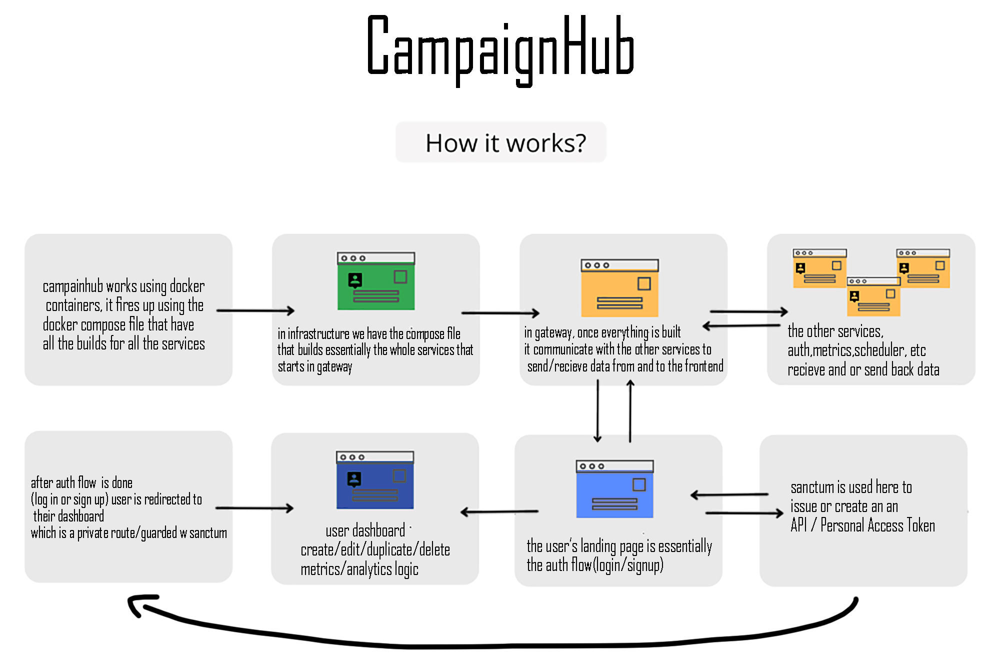

**CampaignHub**

**Table of Contents**

1. Project Overview
2. Architecture & Services
3. Backend Microservices

   * Auth Service
   * Campaign Service
   * Metrics Service
   * Scheduler Service
   * Analytics Service
4. API Endpoints & GraphQL Schema
5. Frontend Application

   * React Structure
   * Routing & AuthContext
   * Pages & Components
6. Testing Strategy

   * Unit Tests (PHPUnit)
   * Integration Tests
   * End-to-End Tests (Cypress)
7. Deployment & Docker Setup

---

## 1. Project Overview

i was researching online for a project that isn't something basic like a to-do app or a e-comm website, sure these things can be done but the internet is full of them, so i thought hey how can i combine both and more in a single project? (crazy i know)

and boom :

CampaignHub is a microservice‑based SaaS platform for managing email/SMS campaigns, tracking real‑time metrics, scheduling dispatch, and advanced analytics dashboards. The system comprises five Laravel‑based backend services and a React/Apollo frontend.


hold on a sec, it doesn't make any sense at first BUT to explain it in layman terms, its essentially a to-do app taken to the max, imagine a to-do app but it has SO MUCH FEATURES AND LOGIC that turned it into somewhat of a sass platform.

## 2. Architecture & Services

* **Auth Service**: User registration, login, Sanctum token management.
* **Campaign Service**: CRUD operations for campaigns, A/B test config.
* **Metrics Service**: Ingest & store time‑series metric events (impressions, clicks, conversions).
* **Scheduler Service**: Finds due campaigns and enqueues dispatch jobs.
* **Analytics Service**: Aggregates daily metrics, exposes customizable dashboards.
* **Gateway/API** (GraphQL): BFF layer combining campaign & metrics via GraphQL (Lighthouse).
* **Frontend**: React + React Router + Apollo Client + Tailwind CSS.

Communication uses HTTP + Bearer tokens. Services run in Docker; shared MySQL for each DB.

## 3. Backend Microservices

### Auth Service

* **Key Features**: `/api/register`, `/api/login`, protected `/api/campaigns` (via Sanctum).
* **Routes**:

  * `POST /api/register` → returns `{ token }`
  * `POST /api/login` → returns `{ token }`
  * `GET/POST/PATCH/DELETE /api/campaigns` (protected)
* **Models**: `User` (HasApiTokens).
* **Middleware**: `auth:sanctum`.

### Campaign Service

* **Key Features**: Campaign CRUD, A/B config.
* **Routes** (apiResource): `/api/campaigns`
* **Model**: `Campaign` with `ab_config` JSON.
* **Validation**: title, date fields, status, ab\_config.

### Metrics Service

* **Key Features**: Stores metric events, query by campaign & date range.
* **Routes**:

  * `POST /api/metrics` (body: campaign\_id, metric, count, timestamp)
  * `GET /api/campaigns/{campaign}/metrics?from&to`
* **Model**: `MetricsEvent` (casts `recorded_at`).

### Scheduler Service

* **Key Features**: Artisan command `campaigns:dispatch-scheduled`
* **Command**: finds due campaigns, dispatches jobs.
* **Routes**: none (CLI only).

### Analytics Service

* **Key Features**: Aggregates metrics daily, CRUD dashboards.
* **Database**: `analytics_daily_metrics`, `dashboards` tables.
* **Routes**:

  * `GET /api/analytics/campaigns/{id}/daily?from&to`
  * `GET/POST/PUT/DELETE /api/analytics/dashboards`
* **Model**: `AnalyticsDailyMetric`, `Dashboard` with JSON `config`.
* **Command**: `analytics:aggregate-daily-metrics` (uses internal Sanctum token)

## 4. API Endpoints & GraphQL Schema

### REST Endpoints

| Service   | Method | Endpoint                              | Auth    |
| --------- | ------ | ------------------------------------- | ------- |
| Auth      | POST   | `/api/register`                       | Public  |
| Auth      | POST   | `/api/login`                          | Public  |
| Campaign  | GET    | `/api/campaigns`                      | Sanctum |
| Campaign  | POST   | `/api/campaigns`                      | Sanctum |
| ...       | ...    | ...                                   | ...     |
| Metrics   | POST   | `/api/metrics`                        | Sanctum |
| Metrics   | GET    | `/api/campaigns/{id}/metrics`         | Sanctum |
| Analytics | GET    | `/api/analytics/campaigns/{id}/daily` | Sanctum |
| Analytics | GET    | `/api/analytics/dashboards`           | Sanctum |
| Analytics | POST   | `/api/analytics/dashboards`           | Sanctum |

### GraphQL (Gateway)

```graphql
# Query
type Query { campaigns: [Campaign!]!, campaign(id:ID!): Campaign!, campaignMetrics(id:ID!): CampaignMetrics! }
# Mutation
type Mutation { login(...): String!, createCampaign(...): Campaign!, ... }
```

## 5. Frontend Application

* **Stack**: React 18, Vite, Apollo Client, React Router v6, Tailwind.
* **Auth**: JWT in `localStorage`, `AuthContext` provides `login`, `logout`, and guards via `PrivateRoute`.
* **Routes**:

  * `/login`, `/signup` (public)
  * `/` (home campaigns list)
  * `/campaign/:id` (details)
  * `/campaign/:id/metrics` (metrics dashboard)
  * `/dashboards` (analytics builder)
* **Components**:

  * `Home` (lists campaigns, modals for create/edit)
  * `CampaignDetails` (info + A/B + metrics overview + chart)
  * `MetricsDashboard` (fetches raw metrics via GraphQL)
  * `DashboardBuilder` (grid layout + widget picker)

## 6. Testing Strategy

### Unit Tests (PHPUnit)

* Each service has PHPUnit set up in Docker with `:memory:` SQLite.
* **Auth**: User registration, login, token creation.
* **Campaign**: Model factories, CRUD endpoints.
* **Metrics**: `MetricsEvent` factory & DB assertions.
* **Scheduler**: Command dispatch test.
* **Analytics**: factory for `AnalyticsDailyMetric` and dashboard CRUD.

### Integration Tests

* Feature tests for REST APIs in each service using `RefreshDatabase`.
* GraphQL tests in Gateway ensure query + mutation flows.

### End-to-End (Cypress)

* **Auth Flow**: Sign up, login, landing page.
* **Campaign CRUD**: Create, edit, duplicate, delete via UI.
* **Metrics Views**: Chart rendering.
* **Analytics Dashboards**: Builder UI with drag‑drop/grids.
* **Logout**: Clears session & redirects.

## 7. Deployment & Docker Setup

* **Docker Compose** defines 6 services + MySQL + Redis:

  ```
  version: '3.8'
  services:
  mysql:
    image: mysql:8...
  auth, campaign, metrics, scheduler, analytics, gateway:
    build: ./services/<name>
    env_file: ./services/<name>/.env
    depends_on: [mysql]
    ports: ...
  frontend:
    build: ./apps/frontend
  ```
* Each service Dockerfile includes PHPUnit extensions for testing.

and i think thats all folks, thank you for taking the time to read this!
